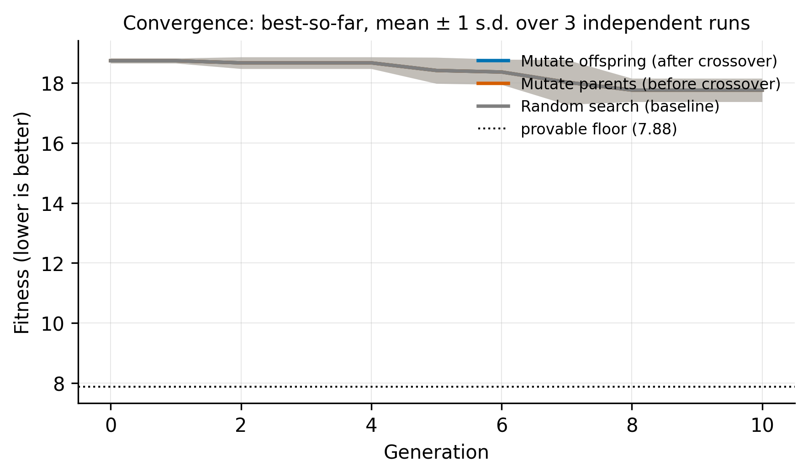
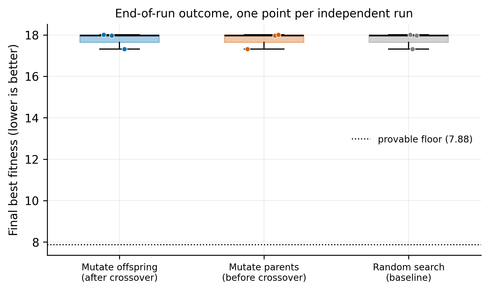
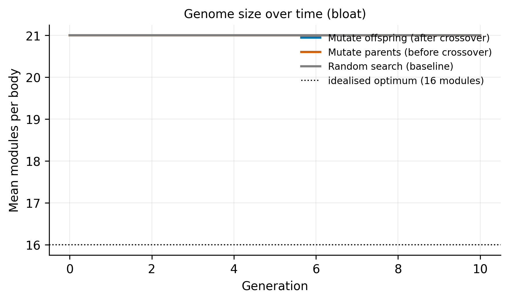
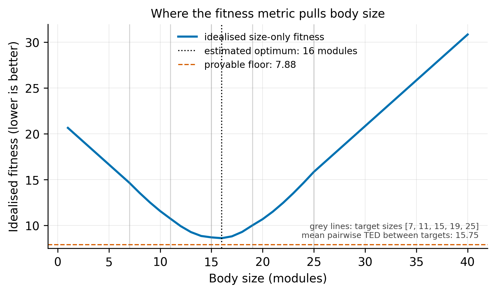
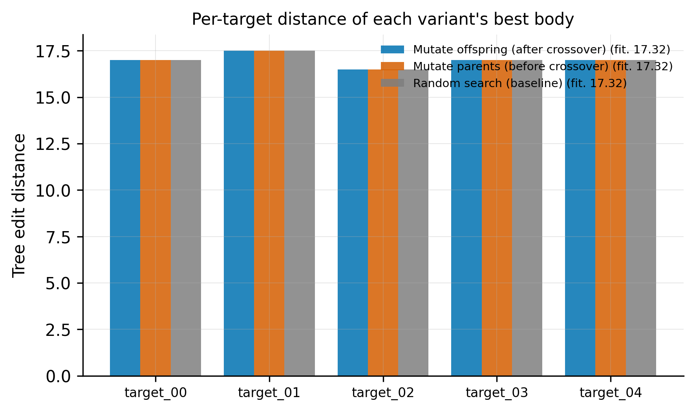

# Assignment 1 Experiment Setup

The research question: **does mutating the parents before crossover differ
from mutating the offspring after it, at an identical evaluation budget?**

We answer this question by running 3 variants of EA (random search, parent
mutation, cildren mutation) over several randomization seeds with eaual evaluation budget, and aggregating the
the results from which we draw the report figures and tables.


---

## 1. Files

```
assignments/assignment_1/
├── run_experiment.py              entry point: run EAs, then analyse it
├── tree_edit_distance.py          the assignment's fitness metric (DO NOT MODIFY)
├── target_bodies/                 the 5 target phenotypes, (DO NOT MODIFY)
└── experiment/
    ├── config.py                  every tunable parameter, in one dataclass
    ├── variants.py                the EA subclasses + registry (CURRENTLY ONLY HAS STUB EAs)
    ├── fitness.py                 loads the targets, wraps the official fitness
    ├── runner.py                  executes the grid, one database per run
    ├── dataset.py                 parses all run databases into a single pandas dataframe
    ├── analysis.py                fitness floor, summary table, significance tests
    └── figures.py                 utilities for creating report figures
```

---

## 2. ⚠️ Swapping in the real EA

> **All variants are registered in `experiment/variants.py`. Currently it only
> holds mock EA algorithms. PLEASE EDIT WHEN REAL ONES ARRIVE

```python
from my_ea import MutateChildEA, MutateParentEA, RandomSearch


VARIANTS = {
    "mutate_child":  MutateChildEA,
    "mutate_parent": MutateParentEA,
    "random_search": RandomSearch,
}
```

Right all EA slots point at `StubEA`, a throwaway with no crossover and
no mutation. It exists only so the pipeline can be tested — **its numbers are
meaningless**, and all three variants currently produce identical results.

A variant is an **`ariel.ec.EA` subclass** whose `__init__` takes
`(seed, db_path, cfg)`. This allows us to simply call the inherited `.run()` to
actually run the whole loop!


Important to remember when integrating with other EA classes:

1. **`is_maximisation=False`** — fitness is lower-is-better and ARIEL defaults
   to `True`. Wrong value makes `get_solution("best")` return the *worst* body,
   with no error. (`_ea_kwargs` sets this for you.)
2. **Write to the `db_path` you are handed** — never fall back to
   `config.db_file_path`, or every run overwrites the same file.
3. **Seed `random`, `numpy` *and* `torch`** before building the population.


---

## 3. Running it

```bash
# fast end-to-end check of every code path (~10 s)
python run_experiment.py --smoke

# the real thing (~15 min single-process)
python run_experiment.py
```

Each invocation recomputes everything from scratch.

---

## 4. Experiment setup

Every registered variant is run once per seed, from scratch:

```
runs = n_variants × n_seeds = 3 × 10 = 30 independent runs
```

A **seed** is one independent repeat: it fixes the initial population and every
random choice thereafter, so two variants sharing a seed start from the same
place. we use 10 to satisfy the assignment requirements.

Each run gets its own directory with an ARIEL SQLite database (the complete
generation-by-generation history) and a `meta.json` recording the variant,
seed, wall time and realised evaluation count:

```
results/<variant>/seed_NN/database.db
results/<variant>/seed_NN/meta.json
```

`dataset.py` then reads all 30 databases into a single tidy DataFrame — one row
per (variant, seed, generation) — and everything downstream reads only that.

**The budget is measured in fitness evaluations, not generations or time**,
because it's more comparable across algorithms (random search
has no generations, and wall time depends on the machine):

```
budget = population_size + generations × offspring_per_generation
       =       50        +     100     ×          50               = 5,050
```

The runner reads the realised evaluation count back out of every database and
warns loudly if the variants disagree, since an unequal budget would invalidate
the whole comparison.

---

## 5. Outputs

### Figures (`figures/`)

**fig1 - convergence.** The Golden plot (which the assignment explicitly asks for): best-so-far
fitness across generations, mean ± 1 s.d. over the independent runs.



**fig3 - end-of-run distribution.** Final fitness per variant as a box-plot



**fig4 — genome size (bloat).** Mean modules per body over time, against the
estimated optimal size. Shows whether the fitness function's implicit size
penalty is enough to stop bodies growing.



**fig5 — what's the optimal genome size** See section 6 of how we find the
"optimal" tree size.



**fig6 — champion breakdown.** Per-target distance for each variant's best
body. This might be nice because aggregated fitness hides *which* target a compromise body sacrifices;



### Tables (`tables/`)

| file | contents |
|---|---|
| `per_generation.csv` | the tidy frame behind every figure: one row per (variant, seed, generation), with best/mean/worst fitness, best-so-far, population size, mean module count |
| `final_per_seed.csv` | one row per run - **the unit of statistical analysis** |
| `summary.csv` | per-variant mean, std, min, median, max of final fitness |
| `pairwise_tests.csv` | Mann–Whitney U for every pair of variants |

I googled how we cood add credence to whether our observed results are trully
different or not (looking past the visuals). Naturally statistical tests came
up, but with N = 10, there's kinda not a lot of data. So **Mann–Whitney U**
popped up as a method that does not assume normality.
Its p-value is the probability of seeing a separation this large if the two
variants were actually identical. I'm not a stats person so I have no idea if
I'm applying it correctly or not xD

---

## 6. Some cool stats about the target bodies
I think we could add these to the report!

### The fitness floor is 7.875

Expalantion generated via Claude (sorry, I'm bad at explaining stuff):

No body can be close to all five targets at once, because the targets are far
from each other. Tree edit distance is a metric, so for any candidate body `C`
and any two targets `A`, `B` the triangle inequality gives:

```
d(C,A) + d(C,B)  ≥  d(A,B)
```

*(Intuition: travelling `A → C → B` is one way of editing A into B, and
`d(A,B)` is the cheapest way, so it cannot cost more than that route.)*

Let `a₀…a₄` be our body's distances to the five targets. Write that inequality
out for all 10 pairs of targets, using the measured pairwise distances:

```
a₀ + a₁ ≥  8.5      a₁ + a₂ ≥ 12.0      a₂ + a₃ ≥ 16.0
a₀ + a₂ ≥ 12.0      a₁ + a₃ ≥ 12.5      a₂ + a₄ ≥ 18.5
a₀ + a₃ ≥ 14.5      a₁ + a₄ ≥ 20.5      a₃ + a₄ ≥ 22.0
a₀ + a₄ ≥ 21.0
```

Now add all ten lines together. **Each `aᵢ` appears exactly 4 times**, because
each target is paired with the 4 others. So the left side sums to `4 · Σa`, and
the right side sums to 157.5:

```
4 · Σa  ≥  157.5
    Σa  ≥  39.375
  mean  =  Σa / 5  ≥  7.875
```

Since `fitness = mean + std` and `std ≥ 0`, **no body can ever score below
7.875.** As one formula:

```
floor = (sum of all pairwise target distances) / (k · (k − 1)) = 157.5 / 20
```

Sanity check: the mean pairwise distance between targets is 15.75, and half of
that is 7.875 — the floor is "be the midpoint of every pair simultaneously",
which no single body can actually manage. So it is approached, never reached.

Computed in `analysis.target_set_facts()`; drawn on fig1, fig3 and fig5.

### The optimal size: 16 modules

Again, explanation generated via Claude:

Editing a body of `n` modules into a target of `m` costs **at least `|n − m|`**,
because relabelling never changes the module count — surplus modules must be
deleted at 1.0 each.

So for a body of size `n`, the best conceivable set of five distances is
`|n − mᵢ|` against the target sizes (7, 11, 15, 19, 25). Feed those through the
real fitness formula, sweep `n`, and take the minimum:

```python
for n in range(1, 41):
    deltas = [abs(n - m) for m in sizes]
    curve[n] = mean(deltas) + population_std(deltas)
```

```
 n | |n−m| per target      | mean |  std | mean+std
15 | [8, 4, 0, 4, 10]      | 5.20 | 3.49 |   8.69   ← lowest mean
16 | [9, 5, 1, 3, 9]       | 5.40 | 3.20 |   8.60   ← minimum
20 | [13, 9, 5, 1, 5]      | 6.60 | 4.08 |  10.68   ← our module budget
```

Note that 15 minimises the *mean* but 16 wins overall: growing slightly makes
the five distances more even, and the `+std` term rewards that more than it
costs. The std term pushes the optimum **upward**, away from the median target
size.

**Why it matters:** this is pretty good as now we can ponder the dynamics of
our EA solutions!