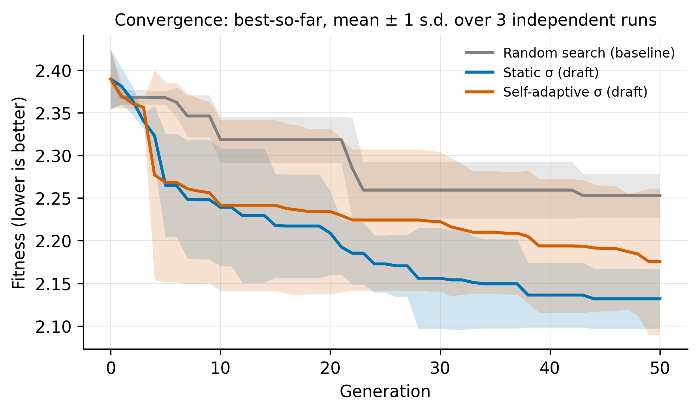
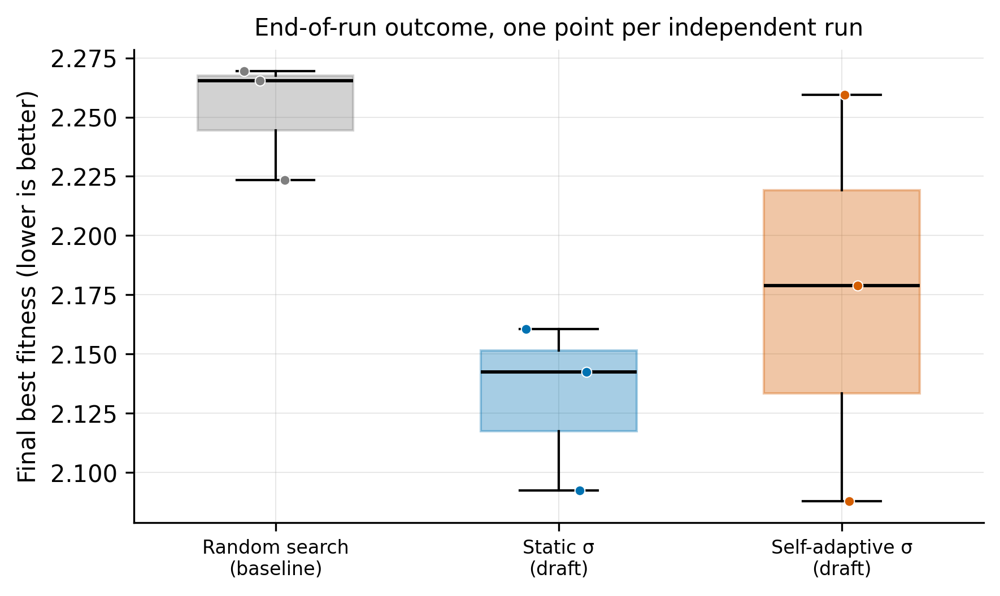
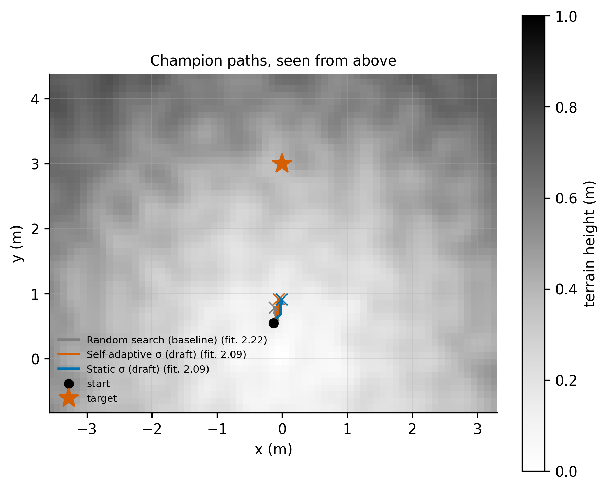
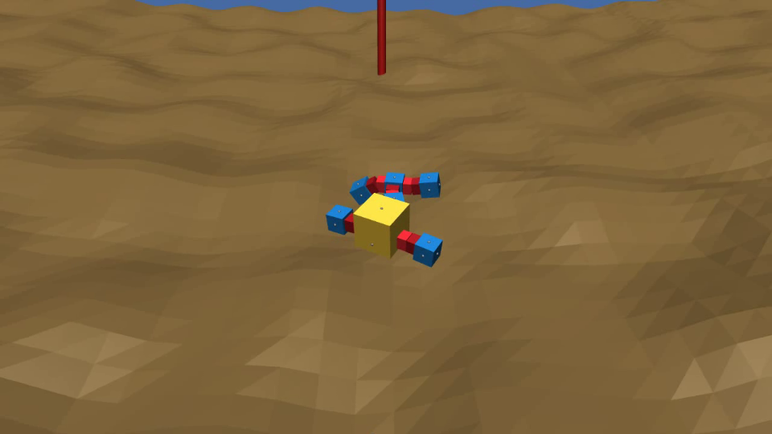

# Assignment 2 Experiment Code Documentation

This folder holds everything needed to **evolve a neural-network controller for
a John Set robot, run any EA on it over many seeds in parallel, and analyse the
results**: tables, statistics, figures and videos of the best robots.

The agreed comparison is fixed versus self-adaptive mutation strength, with
random search as a baseline. The gecko/crater setup and final settings still
need pilot validation. The harness also supports other registered EAs.

---

## 1. What is implemented, and how to run it

### What works today

- **Evaluation:** a controller's weights go in, one physics simulation runs, and
  out comes its fitness (distance to the target at the end) plus what the robot
  did (where it ended, how far it travelled, whether the physics failed).
- **Any world and any John Set body**, chosen by name in the config.
- **An EA kit:** a `NeuroEA` base class that handles seeding, evaluation,
  logging and the shared settings, so a new EA is only its own operators.
- **Random search**, the baseline the brief requires.
- **Two mutation-only EAs** (fixed σ and self-adaptive σ), with configurable settings (section 2).
- **Parallel runs:** every (EA, seed) pair runs in its own process, as many at
  once as you allow.
- **Full logging:** every individual records its parents, how it was made and
  what it did, so operator statistics can be computed after a run.
- **Analysis:** per-generation metrics, statistical comparisons, figures, a
  video of each EA's best robot, and a live 3D viewer.

### How to run an experiment

There are no command-line options: **the config is the interface.**

**1. Edit `CONFIG`** at the bottom of `neuroevolution/config.py`:

```python
CONFIG = ExperimentConfig(
    variants=("random_search", "static_sigma", "self_adaptive"),
    seeds=tuple(range(10)),        # one independent run per seed, per EA
    population_size=50,            # μ: initial batch, and survivors kept each generation
    generations=100,
    offspring_per_generation=50,   # λ: children made and evaluated each generation
    sim_duration=15.0,             # simulated seconds per evaluation
    workers=8,                     # runs in parallel; leave out to use every core
    **outputs("my_experiment"),    # results go to outputs/my_experiment/
)
```

Give every experiment its own `outputs("name")`, so a pilot can never overwrite
final results. `SMOKE` is a small ready-made config for checking that
everything works.

**2. Run it** (from the repository root):

```sh
uv run assignments/assignment_2/run_experiment.py
```

It runs every EA in `variants` once per seed, then writes all tables, figures
and videos (section 4).

**3. Watch the best robots in 3D** (optional):

```sh
uv run assignments/assignment_2/view.py
```

This opens each EA's best robot in turn, live and on a loop. Close the window
for the next one.

**4. Run the tests** (optional, about 15 seconds):

```sh
uv run pytest assignments/harness/tests assignments/assignment_1/tests assignments/assignment_2/tests
```

**How long it takes.** One 15-second evaluation costs about 0.2 s of compute.
A run with the default budget (5,050 evaluations) takes roughly 17 minutes, and
runs execute in parallel, so 3 EAs × 10 seeds on 8 cores is about an hour.

### Where things are

```
assignments/
├── harness/                    shared with Assignment 1: runner, dataset, statistics, plots
└── assignment_2/
    ├── run_experiment.py       run the configured experiment, then analyse it
    ├── view.py                 watch the best robots in the 3D viewer
    ├── neuroevolution/
    │   ├── config.py           ← every parameter; CONFIG is what runs
    │   ├── variants.py         ← the EAs that exist (the registry)
    │   ├── ea.py               the EAs: NeuroEA base class, random search, 2 drafts
    │   ├── scene.py            world + body + target
    │   ├── controller.py       the neural network
    │   ├── genotype.py         how a genome is stored
    │   ├── evaluator.py        genome -> one simulation -> fitness
    │   ├── provenance.py       what each individual records about itself
    │   ├── metrics.py          per-generation numbers (σ, diversity, ...)
    │   ├── replay.py           videos and the live viewer
    │   └── figures.py          the path-over-terrain figure
    ├── tests/                  the automated tests
    ├── docs/                   images used in this guide
    └── outputs/                everything runs produce (not committed to git)
```

---

## 2. What still needs to be done

**Final experiments have not been run.** The implementations are ready for
pilot testing; default parameters are not tuned settings.

- **Random search** is real and final: the brief requires it whatever the
  research question.
- **Fixed σ and self-adaptive σ** share tournament parent selection and elitist
  (μ + λ) survival. Their settings are in `ExperimentConfig` and saved in each
  run's metadata. Select final settings using separate pilot seeds.
- **The example outputs in section 4 are from a small test run**, not an
  experiment. Do not draw conclusions from them.

### Mutation variants and pilot choices

Both EAs sample tournament entrants with replacement, select the lowest-fitness
parent, and create one child by adding independent Gaussian noise to every weight
and bias. There is no crossover or separate mutation-probability gate. This keeps
the comparison focused on step-size control rather than recombination. The best
μ parents/children survive; stable sorting gives existing parents priority on ties.

Fixed mutation uses `static_sigma`. Self-adaptation inherits the parent's σ,
mutates its logarithm by `tau * N(0,1)`, bounds it, and uses the resulting σ to
mutate the weights. `tau = adaptation_tau_multiplier / sqrt(n)`, where n includes
all network weights and biases. The default multiplier of 1 follows the initial
recommendation in Beyer and Schwefel (2002), section 4.2.2.1
([paper](https://doi.org/10.1023/A:1015059928466)); it is not an optimum established
for this controller. σ evolves through inheritance and selection, not a prescribed
decrease or a stagnation-triggered rule.

Pilot defaults are `static_sigma=initial_sigma=0.1`, `sigma_min=0.001`,
`sigma_max=10`, and `tournament_size=3`. The bounds are numerical safeguards,
not literature-derived optima. Offspring tags record `mutation_l2`,
`mutation_rms` and `sigma_at_bound` for checking the effective perturbations
and whether the bounds influence the search. These tags are saved in the database;
the existing CSV metrics do not yet aggregate them.

Tournament selection and elitist survival retain the draft's common setup.
They favour immediate fitness gains, which may also retain old σ values or reduce
diversity. Their interaction with adaptation belongs in the analysis; preserving
the best controller does not guarantee successful self-adaptation.

The 9 October screening pilot compared fixed σ values 0.03, 0.1 and 0.3,
self-adaptation starting at 0.1, and random search. Each used seeds 8101–8103,
30 individuals, 30 offspring and 20 generations (630 evaluations per run).
Fixed σ = 0.03 had the lowest mean final distance, but several runs were still
improving. A confirmation pilot therefore uses 100 generations and starts both
EAs at σ = 0.03. This is pilot tuning, not evidence that either method is superior.
Use fresh seeds for final experiments and report tuning costs separately.

The confirmation pilot completed all six runs (3,030 evaluations each). Mean final
distance was 2.227 m for fixed σ and 2.337 m for self-adaptation. These three pilot
seeds do not establish a performance difference. Survivor mean σ ended at 0.0178,
0.0210 and 0.0318 across the adaptive runs, so adaptation did not simply freeze or
uniformly decrease. Neither pilot recorded a physics failure or a σ-bound hit.
Together they used 27,630 evaluations.

All confirmation runs still improved in generations 75–100: 0.016–0.035 m for
fixed mutation and 0.008–0.018 m for self-adaptation. Gains had slowed, but these
runs do not establish a plateau. Check a longer pilot budget before freezing final
runs; keep the body, world and shared selection unchanged. Replays of the screening
pilot's best controllers reproduced stored scores, with modest upright movement.

Run these from the repository root, with a new output name each time:

```sh
uv run assignments/assignment_2/run_pilot.py pilot-screen --phase screen --workers 4
uv run assignments/assignment_2/run_pilot.py pilot-confirm --phase confirm --workers 6
uv run assignments/assignment_2/summarise_pilot.py assignments/assignment_2/outputs/pilot-confirm
```

The pilot runner refuses existing output directories and checks each evaluation
budget. It saves settings and source provenance alongside the databases.
The summary checks completeness, failures, σ bounds and late-run improvement;
its plots show means and standard deviations across pilot seeds.

Population metrics now use selected survivors following the harness correction.
Endpoint diversity measures differences in final XY positions, not gait diversity.
The failure penalty still assigns the starting distance; check failures separately,
since that score can favour a failed controller over one that moves away.
Use a new output name for every run batch: the runner currently replaces an
existing variant/seed directory. Final runs also need explicit verification against
the requested budget, not just agreement between variants' counts.

### Adding an EA

1. Subclass `NeuroEA` in `ea.py` (the draft EAs there are worked examples),
   write your stages, and list them in `stages()`:

   ```python
   class MyEA(NeuroEA):
       def stages(self):
           return [EAOperation(self.reproduce), EAOperation(self.evaluate),
                   EAOperation(self.select_survivors)]
   ```

2. Register it in `neuroevolution/variants.py`:

   ```python
   "my_ea": Variant(MyEA, "My EA (what it does)", "#009E73"),
   ```

3. Add `"my_ea"` to `variants` in your config and run.

Three rules:
1. create children with `mark_offspring(child, parents, operators)`
so they are logged
2. use `self.cfg.population_size`, never ARIEL's global
`config`
3. do **not** add `from __future__ import annotations` to a file that
defines stages (ARIEL then rejects every stage with a confusing error).

### Decisions still open

These should come from small pilot runs:

- **World:** crater (the current default) or flat ground.
- **Target distance (`target_y`) and simulation length (`sim_duration`)**:
  Too little time and nothing reaches the target; too much
  and every EA reaches it, so they cannot be told apart.
   For reference: random controllers move a
  median of 0.27 m in 15 s; the target is about 2.5 m from where the robot starts.
- **Budget and number of seeds**: long enough that every EA's curve flattens out;
  at least 5 seeds (the brief), ideally 10.
- **σ values**, if the research question is about mutation strength: tune the
  static baseline over a few values so the comparison is fair.
- **Which per-generation metrics to plot**: σ, diversity, success rate and the
  rest are all computed (section 4), but only the fitness figures and the paths
  are drawn so far.

---

## 3. Assumptions

These choices are built into the code. Each is a config parameter unless noted.

### The robot and the world

- **The robot starts at rest on the ground.** ARIEL places robots slightly
  *inside* bumpy terrain, which made the physics fling them up to 1.3 m into the
  air, and evolution would have bred catapults instead of walkers. So the robot is
  first placed clear of the ground and allowed to settle, and that resting pose
  is where every evaluation starts. On the crater it comes to rest at
  (−0.13, 0.54) rather than exactly (0, 0); everything is measured from where it
  actually starts.
- **Target: straight ahead**, at (0, `target_y`) with `target_y = 3` m. Every
  body faces +y at the start.

### What counts as success (fitness)

- **Fitness = the distance from the robot to the target at the end of the
  simulation. Lower is better.** Only the final position counts: there is no
  early stop when the robot arrives, so overshooting or wandering off afterwards
  is penalised, and arriving early earns nothing extra.
- **Every robot gets the same time,** `sim_duration` = 15 simulated seconds, so
  results do not depend on how fast your computer is.
- **If the physics goes unstable**, the evaluation is flagged as failed and
  scored as if the robot never moved. Failures are counted (section 4).

### The controller (the robot's "brain")

The controller is a small neural network. Its weights are **evolved, not
trained**: there is no backpropagation. Mutation changes the weights, each
version drives the robot once, and selection keeps the ones that got closer.

It reads these **11 inputs**:

| input | count | why it is there |
|---|---|---|
| joint angles | 6 | the robot "feels" its own posture and can react when slipping |
| a clock: `sin` and `cos` of time, at 1 Hz | 2 | walking repeats, but the network has no memory, so without a changing input it would freeze in one pose. The clock gives it a rhythm (this is an input, not a CPG controller, which the brief bans) |
| direction to the target, relative to where the robot faces | 2 | lets it steer; "the target is 30° to my left" |
| distance to the target, scaled to start at 1 | 1 | how far there is still to go |

- **Network:** 11 inputs → 8 hidden neurons → 6 outputs (one target angle per
  motor, between −90° and +90°).
- **Genome: 150 numbers** (the weights and biases).
- **Why so small:** evolution gets one score per simulation and has to find
  improvements by random changes. The more weights there are, the rarer a useful
  change becomes, so a large network would barely improve within our budget.
- **The network is consulted 50 times per simulated second** (`control_hz`);
  between consultations the motors hold their last command.

### The genome and mutation

- **A genome is `{"weights": [150 numbers], "sigma": s}`.** σ (sigma) is the
  mutation step size that created the individual: the standard deviation of the
  random noise added to every weight. It is *how much* weights change, not the
  probability of changing them. One σ per genome, not one per weight.
- **Initial weights are random, from a normal distribution with spread 0.5**
  (`init_scale`). Random search draws from the same distribution, so this choice
  also defines the baseline.
- **There are no limits on the weights.**

### How runs are compared

- **The budget is the number of evaluations,** not time or generations:
  `population_size + generations × offspring_per_generation`. All EAs in an
  experiment get the same budget, and the code checks this after every run.
- **For a given seed, every EA starts from the same initial population,** so
  results can be compared seed by seed.
- **A seed is one independent run.** Results never depend on how many runs
  execute in parallel.

---

## 4. Outputs

`run_experiment.py` writes everything to `outputs/<name>/`:

```
outputs/<name>/
├── results/<ea>/seed_NN/
│   ├── database.db     every individual ever evaluated (genome, fitness, history)
│   └── meta.json       the config, evaluation count and run time
├── tables/             per_generation.csv, final_per_seed.csv, summary.csv, pairwise_tests.csv
├── figures/            convergence.png, final_distribution.png, trajectories.png
└── videos/             <ea>.mp4: the best robot of each EA
```

The examples below come from a small test run (crater, 3 seeds, population 50,
25 offspring, 50 generations, 10-second simulations, so 1,300 evaluations per
run). They illustrate the outputs; they are **not** results.

### Tables

- **`per_generation.csv`**: one row per EA, seed and generation. Each row
  describes the **population after that generation's survivor selection**: the
  individuals that carry on (μ of them), not the children culled straight away.
  Best-so-far and the operator statistics (success, survival, failures) still
  count every child that was evaluated. Besides the fitness (best, mean, worst,
  best-so-far), it has:

  | column | meaning |
  |---|---|
  | `mean_sigma`, `best_sigma` | mutation step size σ (average; the best individual's) |
  | `mean_distance`, `best_distance` | how far robots travelled from the start |
  | `genotype_diversity` | how different the genomes are from each other |
  | `behaviour_diversity` | how different the robots' end positions are |
  | `success_rate` | share of children that beat their best parent |
  | `improvement_over_parent` | how much children improved on their best parent |
  | `survival_rate` | share of children that made it into the next generation |
  | `parent_fraction` | how many different individuals had children |
  | `failure_rate` | share of evaluations where the physics failed |

  These are empty where they do not apply (random search has no parents).

- **`final_per_seed.csv`**: one row per EA and seed, showing how each run ended. This
  is what the statistics use.
- **`summary.csv`**: for each EA, the mean, spread, best and worst final fitness.
- **`pairwise_tests.csv`**: every pair of EAs compared seed by seed. The key
  column is the **95% confidence interval** of the difference
  (`ci95_low`, `ci95_high`): if it excludes 0 there is a difference; if it is
  narrow around 0 the EAs perform about the same; if it is wide around 0 the
  result is inconclusive and more seeds would help. Two tests back it up (sign
  test and Wilcoxon). Phrase results as "reached a lower final fitness in 7 of
  10 seeds", not "won" (feedback on Assignment 1).

### Figures

**Convergence**: the best fitness found so far, per generation, averaged over
seeds with a band of ± one standard deviation. This is the plot the brief asks for.



**Final distribution**: how each EA's runs ended, one dot per seed. Shows the
spread that a single average hides.



**Paths**: each EA's best robot, seen from above over the terrain (darker is
higher), from where it starts to where it ends.



### Videos

`videos/<ea>.mp4` shows each EA's best robot (1280×720, 25 fps), with the
camera following it from behind and looking towards the target (the red pole).


